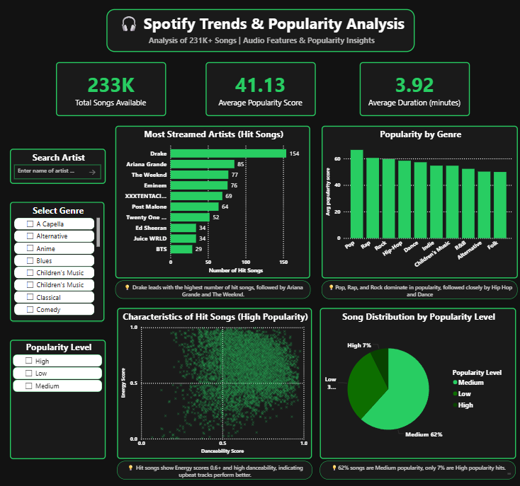

# Spotify Trends & Popularity Analysis (230K Songs) 🎧



This project analyzes a large Spotify dataset (~233,000 songs) to understand what factors influence song popularity. 
The complete workflow was done using **Excel, SQL, and Power BI**, starting from raw data cleaning to building an interactive dashboard.

---

## Project Objectives 🎯

- **Genre Analysis:** Identify market-leading genres based on average popularity scores.
- **Artist Ranking:** Determine which artists hold the highest market share of hit songs.
- **Audio Correlation:** Measure the impact of technical features (Energy, Valence, BPM) on streaming numbers.
- **Market Segmentation:** Analyze the ratio of viral hits vs. average tracks across the library.
- **Trend Identification:** Define the specific acoustic profile that characterizes a "Hit" song.

---

## Tools & Technologies 🛠️

- **Excel** – Data cleaning and preprocessing  
- **SQL** – Data analysis and querying  
- **Power BI** – Dashboard creation and visualization  
- **DAX** – Custom measures and KPIs  

---

## Data Cleaning & Preparation 🧹

* **Removed duplicate records:** Ensured each track ID is unique.
* **Handled missing values:** Filtered out null artists and track names.
* **Duration Conversion:** Converted `duration_ms` to minutes for readability.
* **Segmentation:** Created a `popularity_level` column (High / Medium / Low) using logical formulas.
* **Standardization:** Cleaned artist and genre names (trimmed whitespace).

---

## SQL Analysis 🧠

### Total Number of Songs
```sql
SELECT COUNT(*) AS total_songs FROM spotifyclean;
```

### Top 20 Most Popular Songs
```sql
SELECT track_name, artist_name, popularity FROM spotifyclean ORDER BY popularity DESC LIMIT 20;
```

### Genre-wise Average Popularity
```sql
SELECT genre, AVG(popularity) AS avg_popularity FROM spotifyclean GROUP BY genre ORDER BY avg_popularity DESC;
```

### Song Distribution by Popularity Level
```sql
SELECT popularity_level, COUNT(*) AS total_songs FROM spotifyclean GROUP BY popularity_level;
```

### Artists with the Most Hit Songs (Popularity ≥ 70)
```sql
SELECT artist_name, COUNT(*) AS hit_count FROM spotifyclean WHERE popularity >= 70 GROUP BY artist_name ORDER BY hit_count DESC;
```

---

## Power BI Dashboard 📊

### Visuals Included

* Total number of songs & Average popularity KPI Cards.
* Artist rankings (Top 10 by Hit Count).
* Genre popularity comparison.
* Energy vs. Danceability Scatter Plot (Correlation analysis).
* Song distribution pie chart.

### Filters & Slicers

- Artist  
- Genre  
- Popularity Level (High / Medium / Low)

---

## Key Insights 🔍

- **Genre Dominance:** Pop, Rap, and Rock genres consistently show the highest average popularity.
- **The "Drake Effect"**: Artists like Drake and The Weeknd significantly outperform others in hit volume.
- **Hit Formula:** High-popularity songs show a strong correlation with high Energy (>0.6) and Danceability.
- **Market Saturation:** Only 7% of songs achieve "High" popularity status; 62% remain in the "Medium" tier.
- **Song Time:** The average song duration is approximately **3.92 minutes**

---

## Project Files 📁

* **Cleaned Dataset:** [Download via Google Drive](https://docs.google.com/spreadsheets/d/1TY32Jf7WtHCEyWebft9XHQA3wj1q6pSeqbbC_NU9Zyc/edit?usp=sharing)
* **Power BI Dashboard:** [Download File (.pbix)](spotify_dashboard.pbix)
* **SQL Analysis:** [View SQL Queries](spotify_queries.sql)
* **Project Presentation:** [View Slides (PDF)](Spotify_Presentation.pdf)
* **Full Project Report:** [Read Report (PDF)](Spotify_Project_Report.pdf)

---
